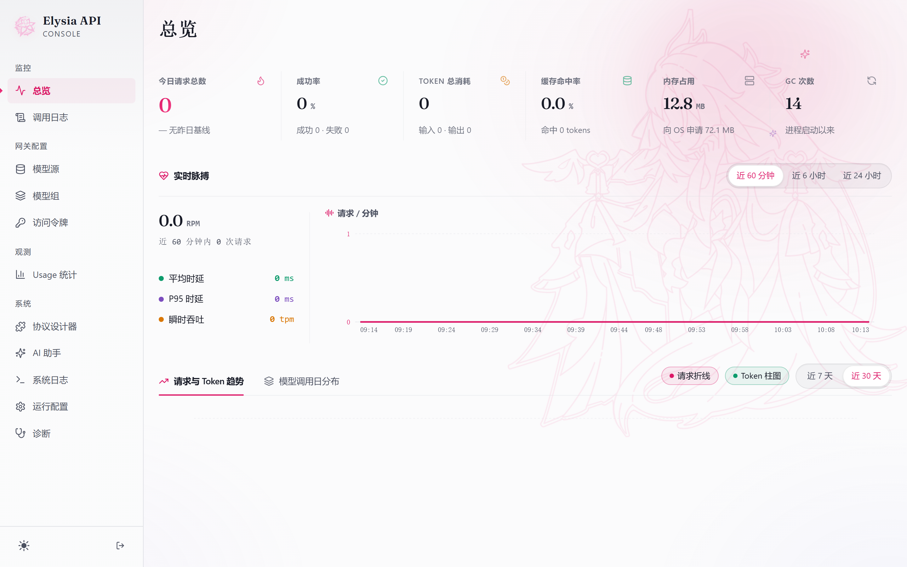
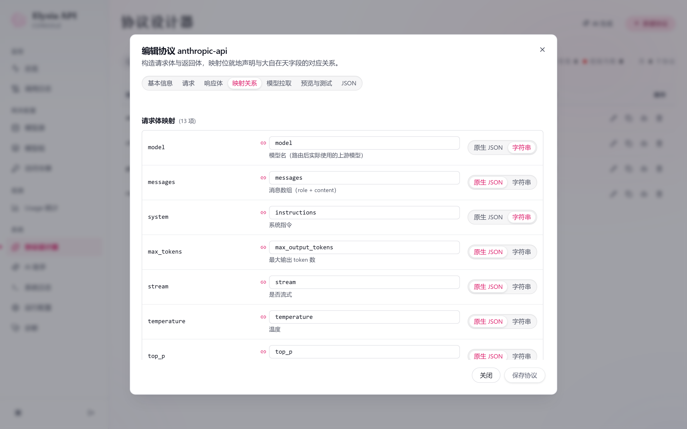
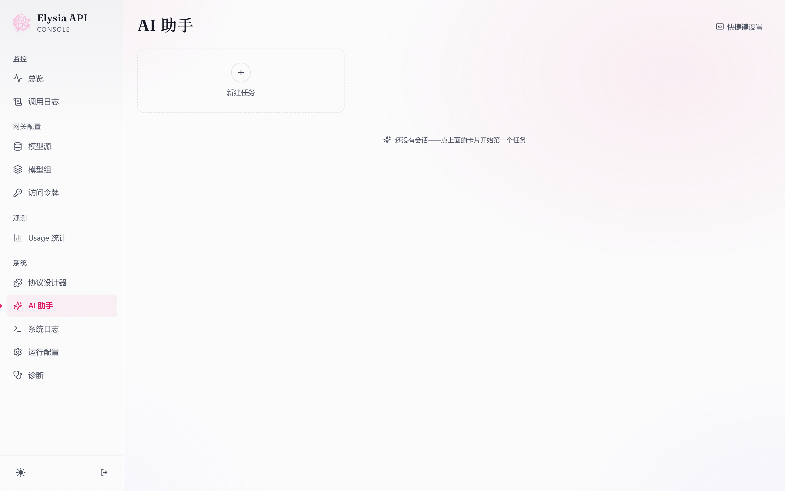
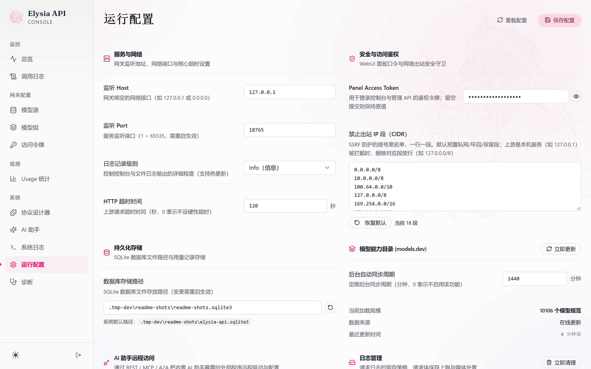

<div align="center">

<picture>
  <source media="(prefers-color-scheme: dark)" srcset="docs/assets/banner.svg">
  
</picture>

**A lightweight, self-hosted AI gateway in a single binary with a built-in WebUI, featuring an embedded management agent to streamline gateway operations. It enables rapid integration of model protocols via a no-code DSL and supports remote orchestration via REST, MCP, and A2A interfaces.**

*一款轻量级自部署 AI 网关（单二进制，内置 WebUI），内置管理 agent 协助网关运维。可依托无代码 DSL 快速接入模型协议，支持通过 REST / MCP / A2A 接口远程调度。*

<p>
  <a href="https://github.com/PinkElysiaDev/Elysia-Api/tags"></a>
  <a href="https://github.com/PinkElysiaDev/Elysia-Api/stargazers"></a>
  <a href="./backend/go.mod"></a>
</p>

<a href="./README.md">简体中文</a> · English

</div>

---

## ✨ Features

The WebUI is embedded into the backend binary through `//go:embed` and served at `/ui/` by default. Runtime configuration uses a bootstrap `config.json`; model sources, model groups, Relay API Tokens, Usage data, and system logs are stored in SQLite.

### 🌐 Gateway Core

- Model groups and load balancing: supports round-robin, sequential, random, and model-group-level permission strategies.
- Multi-format conversion: uses Maheshvara Request / Response / Usage as the single core representation, converting between OpenAI Chat Completions, OpenAI Responses, Claude Messages, and Gemini GenerateContent.
- Responses API: `/v1/responses` can be forwarded natively or converted to Chat / Claude / Gemini upstreams.
- Streaming responses: all four built-in protocols and custom protocols are converted to SSE through stateful Maheshvara decoders / renderers.
- Same-protocol passthrough: when the client and upstream route use the same protocol, requests automatically pass through with zero conversion; only the model name is rewritten and all other fields are preserved.
- Usage statistics: records cache hits, reasoning tokens, multimodal tokens, built-in tool calls, request / response summaries, and retry events.
- Traffic limits: supports model-group-level concurrency and daily request/token limits.
- Operations and diagnostics: includes health checks, system logs, pprof, a WebUI usage dashboard, and hot-reload endpoints.

### 🤖 Management Agent

- The WebUI "AI Assistant" page hosts a built-in general-purpose agent: upload API docs to onboard a protocol (draft → offline verification → approved real tests → save), or ask it to create/update model sources and model groups, query usage with inline charts, drill into failed requests, and maintain outbound security policies.
- Writes and outbound calls are approval-gated (approval cards + plan-mode pause points); session history is traceable, model and thinking effort are configurable, and agent token usage lands in the stats page.
- `elysia` CLI: drive the same engine from the terminal (see [docs/agent-cli.md](docs/agent-cli.md)).

### 🧩 No-Code Protocol DSL

- Protocol Designer: build protocols visually with field-level mappings — every field in the request/response body declares which Maheshvara field it corresponds to; saves take effect instantly.
- Preset protocols: the four standard protocols are themselves data definitions from the same source, viewable, copyable, and editable in the designer.
- AI generation: hand API docs to the AI assistant to produce a protocol draft and run it through verification.
- Model discovery: a custom protocol can declare a model-list endpoint; once declared, model sources referencing it can enable automatic fetching.

### 📡 Remote Orchestration

- REST: `/api/agent/*` management surface (session and message management, SSE streaming responses).
- MCP: `POST /mcp` exposes 9 agent tools (session list/create/get/update/delete, message send, approval respond, stop, clear messages, and more).
- A2A: `POST /a2a` message endpoint + `GET /.well-known/agent-card.json` standard Agent Card.
- Dedicated remote keys: agent-scoped Bearer keys can only drive the AI assistant (`/api/agent`, `/mcp`, `/a2a`), never the `/v1` inference endpoints; `config.agentRemote` master switch (enabled by default).

### 🔋 Supporting Capabilities

- Multi-key scheduling: a model source can configure multiple API keys and schedule them by round-robin / random / priority; **per-key permission auto-discovery** independently requests the model list with each key, automatically obtains each key's available model set (which can be enabled or disabled per key in the panel), and ensures scheduling never switches to a key without permission.
- Model capability catalog: includes a models.dev snapshot for zero-configuration use, periodically updates it online, and persists a cache (automatically falling back to a jsDelivr mirror when models.dev is unavailable); model fetching fills in capabilities such as vision / tools / structured output / reasoning mode / context length. Model-group capabilities are derived from members and enforced (groups without vision automatically remove images; groups without tool support reject tool requests).
- Asynchronous background fetching: model fetching runs as a background task, returns immediately without blocking the page, and exposes progress and results through real-time polling; sources being fetched automatically lock related operations to prevent conflicts.
- Custom fetch URL: sites whose model-list endpoint differs from the request-forwarding endpoint by domain / port / protocol can configure a separate fetch URL.
- Model-level management: fetched models support individual editing / enabling / disabling / deletion and search; refresh uses a preserving merge, so manually added models and user edits are never lost.
- Security hardening: encrypts sensitive fields at rest, compares tokens in constant time, and protects against SSRF with a configurable CIDR deny list (`outbound.deniedIpRanges`, editable from the runtime config page and the agent tools).

## 🖼️ UI Preview

Login page opening animation (character trace motion + background video):


| Overview | Protocol Designer · Mappings |
| :---: | :---: |
|  |  |

| AI Assistant | Runtime Config |
| :---: | :---: |
|  |  |

## 🚀 Quick Start

Prebuilt binaries are published through [GitHub Releases](https://github.com/PinkElysiaDev/Elysia-Api/releases/latest). Download the program for your platform and `SHA256SUMS`; to rebuild from source, see the [Build](#-build) section below.

| Platform | Release file |
| --- | --- |
| Windows amd64 | `elysia-api-windows-amd64.exe` |
| Windows arm64 | `elysia-api-windows-arm64.exe` |
| Linux amd64 | `elysia-api-linux-amd64` |
| Linux arm64 | `elysia-api-linux-arm64` |
| macOS app (universal Intel / Apple Silicon) | `elysia-api-macos.dmg` |

### General Configuration

On first startup, if there is no `config.json` beside the binary, the backend automatically writes a default configuration. Its `panelAccessToken` is generated randomly with `crypto/rand` (not a `change-me` placeholder), and the generated token and configuration path are printed in the startup log—rotate the token promptly after using it to sign in to the panel. No manual file creation is required; the template below is for reference only.

Create the runtime configuration from `config.json.example` in the repository root and change at least `panelAccessToken`:

```json
{
  "host": "127.0.0.1",
  "port": 8765,
  "panelAccessToken": "change-me",
  "databasePath": "elysia-api.sqlite3",
  "logLevel": "info",
  "httpTimeout": 120,
  "secretKeyPath": ".master-key",
  "openBrowserOnStart": true
}
```

When `databasePath` and `secretKeyPath` use relative paths, they are resolved relative to the directory containing `config.json`.
`openBrowserOnStart` controls whether the console opens automatically in the system default browser on startup (defaults to attempting it; set `false` when managed by another process or in headless environments—missing open commands are silently skipped).

### Windows

Place `elysia-api-windows-amd64.exe` and `config.json` in the same directory, then run:

```powershell
.\elysia-api-windows-amd64.exe --config .\config.json
```

If `config.json` is in the same directory as the executable, you can also double-click the executable. Without `--config`, the program reads `config.json` from the current directory. If the file does not exist on first startup, it is created automatically with a random `panelAccessToken` (see the startup log), and the console is then opened in the default browser (set `openBrowserOnStart: false` to disable).

### Linux

Place `elysia-api-linux-amd64` and `config.json` in the same directory, then run:

```bash
chmod +x ./elysia-api-linux-amd64
./elysia-api-linux-amd64 --config ./config.json
```

### macOS

Download `elysia-api-macos.dmg` from Releases, double-click it, and drag `ElysiaApi` to the `Applications` shortcut to install. Then launch it from Launchpad (macOS 12+, Intel / Apple Silicon):

- The first launch automatically generates the configuration and a random `panelAccessToken`; all data is stored in `~/Library/Application Support/ElysiaApi/` (`config.json`, SQLite, `.master-key`, and `elysia-api.log`).
- The first window shows the login page. Choose **Copy panel access token** from the menu bar and paste it to sign in. Manual login saves the session and cookie across window and app restarts; signing out requires logging in again.
- Closing the window (⌘W) keeps the service running. Reopening from the menu bar, Dock or Launchpad opens Overview when signed in, or the login page otherwise, with the saved frame and theme, including recovery after a display disconnects.
- The menu bar icon stays icon-only in every state; its menu opens with a branded header (running state dot, actual address, version and a 24-hour request pulse curve in the panel's rose accent) and keeps start/stop service, copy API address, copy panel access token, view logs and preferences. Unexpected failures trigger up to three automatic restarts, followed by manual retry.
- **Preferences…** (⌘,) controls launch at login and important notifications. Login startup is off by default and opens in the background when enabled. Notifications default to on; system permission is requested before the first notification.
- In-app updates include download progress, cancellation and retry. SHA-256, DMG integrity and signature checks precede replacement of the entire app bundle, with rollback on replacement failure. Configuration, database, master key and window preferences survive updates.
- The default port is `8765`. If it is occupied, the app automatically uses an available port starting at `8799` (the actual port appears in the menu bar status row and panel address).

> CI artifacts use ad-hoc signing. If Gatekeeper blocks the first launch, run
> `xattr -d com.apple.quarantine /Applications/ElysiaApi.app` and open it again.

### Docker

Build the image from the repository root first:

```bash
docker build -t elysia-api:local .
```

Minimal run command:

```bash
docker run -d \
  -p 8765:8765 \
  -v elysia-data:/data \
  -e ELYSIA_API_HOST=0.0.0.0 \
  elysia-api:local
```

On first startup, if the configuration file does not exist, the backend generates the configuration and a random `panelAccessToken` in the data volume. Visit `http://127.0.0.1:8765/ui/` and sign in with the token from the startup log.

For public access, configure `ELYSIA_API_HOST=0.0.0.0`; the default is `127.0.0.1`.

To provide the database master key through an environment variable, add `-e ELYSIA_API_MASTER_KEY=...` to the run command.

Recommended Compose configuration:

```yaml
services:
  elysia-api:
    image: elysia-api:local
    container_name: elysia-api
    restart: unless-stopped # start automatically
    init: true
    read_only: true
    tmpfs:
      - /tmp:size=64m,mode=1777
    security_opt:
      - no-new-privileges:true
    cap_drop:
      - ALL
    ports:
      - "${ELYSIA_HTTP_PORT:-8765}:8765"
    environment:
      ELYSIA_API_HOST: 0.0.0.0
      # Uncomment when using an external database master key, and inject it through a secure environment-management method:
      # ELYSIA_API_MASTER_KEY: your-master-key
    volumes:
      - elysia-data:/data

volumes:
  elysia-data:
```

### WebUI Initialization

Open the WebUI after starting the backend:

```text
http://127.0.0.1:8765/ui/
```

Sign in with `panelAccessToken`, then add model sources, fetch models, create model groups, and create a Relay API Token in the WebUI. You can then call a model group through the OpenAI-compatible endpoint:

```bash
curl http://127.0.0.1:8765/v1/chat/completions \
  -H "Authorization: Bearer <your-relay-api-token>" \
  -H "Content-Type: application/json" \
  -d '{"model":"default","messages":[{"role":"user","content":"hi"}]}'
```

## 🧩 Maheshvara and the No-Code Protocol DSL

Cross-protocol conversion uniformly passes through the Maheshvara core request / response model: OpenAI Chat Completions, OpenAI Responses, Anthropic Messages, and Gemini GenerateContent are all first parsed into Maheshvara and then rendered for the upstream protocol. A model source's `platform` can be `custom:<protocolID>` (the WebUI lets you select and enter the ID directly); protocols are built visually in the WebUI Protocol Designer page with field-level mappings, and saves take effect instantly. Protocol config example:

```json
{
  "id": "vendor-json",
  "type": "llm",
  "request": {
    "method": "POST",
    "path": "/v2/generate",
    "auth": {"mode": "header", "header": "x-api-key"},
    "body": {
      "model": {"field": "model", "mode": "string"},
      "input": {"field": "messages"},
      "params": {
        "temperature": {"field": "temperature", "default": 0.7, "omitIfEmpty": true},
        "api_version": {"value": "2026-01-01"}
      }
    }
  },
  "response": {
    "fields": [
      {"path": "answer.text", "field": "text"},
      {"path": "finish", "field": "stop_reason"},
      {"path": "usage.prompt", "field": "usage.input_tokens"},
      {"path": "usage.completion", "field": "usage.output_tokens"}
    ]
  }
}
```

Both the request and response body use field-level mappings: every leaf declares which Maheshvara field it corresponds to (`{"field": ..., "mode": "json|string", "default"?, "omitIfEmpty"?}`) or is a constant (`{"value": ...}`); no arbitrary code is executed. The field catalog is served by the schema endpoint and shared by the UI dropdowns, AI generation, and backend validation. Both non-streaming responses and SSE / NDJSON streams can be mapped back to Maheshvara and rendered as any of the four protocols requested by the client.

- Complete field model, four-protocol mapping matrix, reasoning safety conventions, and Gemini Part invariants: [docs/maheshvara-protocol.md](docs/maheshvara-protocol.md)
- Protocol definition field reference: [docs/protocol-definition-reference.md](docs/protocol-definition-reference.md)
- Real-world case — Alibaba DashScope onboarding guide: [docs/custom-protocol-dashscope.md](docs/custom-protocol-dashscope.md)

## 🤖 Management Agent and Remote Orchestration

Beyond chatting in the WebUI, the management agent can be driven by remote programs—scripts, MCP clients (e.g. Claude Desktop, Cursor), or other A2A-capable agents can all treat Elysia-API as a schedulable operations agent:

| Interface | Endpoint | Description |
| --- | --- | --- |
| REST | `/api/agent/*` | Session and message management, SSE streaming responses |
| MCP | `POST /mcp` | 9 tools: `agent_list` / `agent_create` / `agent_get` / `agent_update` / `agent_delete_sessions` / `agent_send_message` / `agent_respond` / `agent_stop` / `agent_clear_messages` |
| A2A | `POST /a2a`, `GET /.well-known/agent-card.json` | Standard Agent Card and message endpoint |

The three remote surfaces share agent-scoped Bearer API key authentication and the `config.agentRemote` master switch (enabled by default; `publicUrl` advertises the endpoint externally). Remote keys are fully isolated from inference Relay API Tokens: they can only drive the AI assistant, never the `/v1` inference endpoints. All agent writes and outbound calls go through approval gating; remote callers answer approval cards through the `agent_respond` tool.

- Remote interface protocol details: [docs/remote-agent-api.md](docs/remote-agent-api.md)
- Full agent tool catalog: [docs/agent-tools-catalog.md](docs/agent-tools-catalog.md)
- `elysia` CLI command reference: [docs/agent-cli.md](docs/agent-cli.md)

## ⚙️ Configuration

`config.json` stores only the bootstrap fields required for startup. Model sources, model groups, Relay API Tokens, Usage data, and system logs are stored in SQLite.

| Field | Description |
| --- | --- |
| `host` | Backend listen address. Use `127.0.0.1` for local-only access. |
| `port` | Backend listen port; the default example is `8765`. |
| `panelAccessToken` | Access token for the WebUI and `/api/admin/*` administrative API. |
| `databasePath` | SQLite database path. Relative paths are resolved relative to the directory containing `config.json`. |
| `logLevel` | Log level, commonly `info` or `debug`. |
| `httpTimeout` | Upstream HTTP timeout in seconds; `0` means unlimited. |
| `secretKeyPath` | Path to the master key file used to encrypt sensitive SQLite fields. Relative paths are resolved relative to the directory containing `config.json`. |
| `webuiDir` | Optional. Leave empty to use the embedded WebUI; set it to override with an external static asset directory. |
| `enablePprof` | Optional. Enables pprof endpoints protected by the panel token. |
| `maxBodyBytes` | Optional. Request body size limit. |
| `agentRemote` | AI assistant remote surfaces (REST / MCP / A2A): `enabled` master switch, `publicUrl` advertised address. |
| `outbound.deniedIpRanges` | CIDR deny list for SSRF protection; ships with default private/reserved ranges and is editable from the runtime config page and the agent tools. |
| `usageLog` | Usage log persistence: retention days, size/record caps, request-body retention policy, and more. |
| `modelCatalog` | Model capability catalog: switch, upstream URL, proxy, and sync interval. |

You can also provide the master key through the `ELYSIA_API_MASTER_KEY` environment variable. In production, if the database directory will be backed up or packaged as a whole, place `secretKeyPath` in a separately protected location or inject it through the environment variable.

### Legacy Configuration Migration

`tokens` and `modelGroups` in legacy configuration are imported into SQLite as compatibility data at startup. New installations should keep only bootstrap fields in `config.json`, such as host, port, database path, panel access token, logging, and diagnostic settings.

## 🛡️ Operations, Endpoints, and Data Backup

### Operations Endpoints

- `GET /health`: public health check endpoint.
- `GET /api/admin/health`: administrative health check endpoint; requires the panel token.
- `POST /api/admin/reload`: administrative hot-reload endpoint; requires the panel token.
- `POST /__reload`: local loopback hot-reload endpoint.
- `POST /__shutdown`: local loopback graceful-shutdown endpoint.

Changing `host`, `port`, `databasePath`, or `enablePprof` usually requires a restart. In production, use systemd, Windows Service Manager, supervisord, Docker, or another process manager to supervise the backend.

### HTTP Endpoints

| Endpoint | Description | Authentication |
| --- | --- | --- |
| `POST /v1/chat/completions` | OpenAI Chat Completions entrypoint | Relay API Token |
| `POST /v1/responses` | OpenAI Responses API entrypoint | Relay API Token |
| `POST /v1/messages` | Native Claude Messages entrypoint | Relay API Token |
| `POST /v1/messages/count_tokens` | Claude-compatible token counting | Relay API Token |
| `GET /v1/models` | List available model groups | Relay API Token |
| `GET /v1beta/models` / `POST /v1beta/models/*` | Gemini-compatible entrypoints | Relay API Token |
| `/api/agent/*` | AI assistant remote REST surface | Agent remote key |
| `POST /mcp` | AI assistant MCP surface | Agent remote key |
| `POST /a2a` | AI assistant A2A surface | Agent remote key |
| `GET /ui/` | WebUI console | Page login |
| `GET /api/admin/*` | Administrative API | Panel Token |
| `GET /debug/pprof/*` | pprof profiling (must be enabled) | Panel Token |
| `GET /health` | Health check | None |

Request authentication supports `Authorization: Bearer <token>`, `x-api-key`, `x-goog-api-key`, and `?key=`. Panel-token scenarios also support the `panel_access_token` cookie.

### Data Backup

The SQLite database uses WAL mode. You will normally see:

- `elysia-api.sqlite3`
- `elysia-api.sqlite3-wal`
- `elysia-api.sqlite3-shm`

For backups, use the SQLite backup tool, or stop the backend before copying all of the database files above together. If the key file is enabled, also back up and protect the `.master-key` referenced by `secretKeyPath`. If the master key is lost, upstream API keys and Relay API Tokens encrypted in SQLite cannot be decrypted.

## 🔨 Build

Install dependencies before the first build or after dependency changes:

```bash
npm install
```

> If `proxy.golang.org` is inaccessible, set the Go module proxy before building: `export GOPROXY=https://goproxy.cn,direct`

Build the WebUI, synchronize embedded assets, and cross-compile standalone binaries for all platforms independently of the build host:

```bash
npm run build
```

Local build artifacts are placed in `dist/standalone/`. This directory is not committed to Git. Formal releases are distributed through GitHub Releases and contain these artifacts:

| Platform | Artifact |
| --- | --- |
| Windows amd64 | `elysia-api-windows-amd64.exe` |
| Windows arm64 | `elysia-api-windows-arm64.exe` |
| Linux amd64 | `elysia-api-linux-amd64` |
| Linux arm64 | `elysia-api-linux-arm64` |
| macOS (universal Intel / Apple Silicon) | `elysia-api-macos.dmg` |

> DMG assembly is available only on macOS (requires swiftc / lipo / codesign / hdiutil) and is produced by CI during release: pushing a `v*` tag publishes automatically, or you can trigger `workflow_dispatch` manually from the Actions page and then download the artifacts. The two bare darwin binaries are only inputs to DMG assembly; command-line scenarios can still use them directly.

On macOS (with compatible **Universal** Command Line Tools, such as 26.6; full Xcode is optional), you can assemble `ElysiaApi.app` and the DMG separately from the darwin binary produced by `npm run build`:

```bash
npm run build:macos-app -- --check-toolchain
npm run test:macos-app
npm run build:macos-app
```

The build checks Swift linking for both architectures before replacing existing outputs, then verifies both universal executables, the app signature and the mounted DMG contents. Running and updating the packaged app does not require Command Line Tools. See [macOS validation](docs/macos-testing.md) for toolchain troubleshooting, automated coverage and the manual acceptance matrix.

Develop the WebUI:

```bash
cd packages/webui
npm run dev
```

The Vite dev server proxies to `http://127.0.0.1:8765` by default.

## 📚 Documentation

| Topic | Docs |
| --- | --- |
| Deployment | [Deployment guide](docs/deployment.md) · [macOS validation](docs/macos-testing.md) |
| Protocols | [Maheshvara core protocol](docs/maheshvara-protocol.md) · [Protocol definition reference](docs/protocol-definition-reference.md) · [DashScope case study](docs/custom-protocol-dashscope.md) |
| AI Assistant | [Remote interfaces (REST / MCP / A2A)](docs/remote-agent-api.md) · [Tool catalog](docs/agent-tools-catalog.md) · [elysia CLI](docs/agent-cli.md) |
| WebUI & API | [Backend API reference](docs/webui-api.md) · [Data model](docs/webui-data-model.md) · [Frontend spec](docs/webui-frontend-spec.md) · [Acceptance checklist](docs/webui-acceptance.md) |

## 🗺️ Project Structure

```text
elysia-api/
├── backend/                # Go backend (the gateway itself)
│   ├── agent/              # Management agent engine (tools, approvals, context compaction)
│   ├── config/             # Configuration loading / hot reload / encryption key
│   ├── relay/              # Upstream forwarding / format conversion / Maheshvara core protocol
│   ├── server/             # HTTP routes / auth middleware / admin API / agent remote surfaces
│   ├── storage/            # SQLite persistence
│   └── webui/              # Embedded WebUI static assets (//go:embed all:dist)
├── packages/webui/         # React + Vite console source
├── docs/                   # Deployment, protocols, AI assistant, WebUI API docs
├── scripts/                # Standalone backend release / npm platform package publish scripts
└── config.json.example     # Minimal bootstrap configuration template
```

## 🤝 License

This project is released under the [MIT License](package.json).
