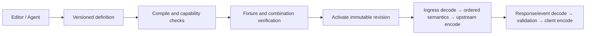

# Protocol engine, editor and native Agent

[简体中文](protocol-guide.md) · [Definition reference](protocol-definition-reference.en.md) · [Evidence and boundaries](protocol-release-readiness.en.md)

One `backend/protocol` engine serves built-in and custom protocols. The editor,
Agent, previews, offline verification and live forwarding share its compiler,
ordered semantic model and immutable revisions. Relay assembles routing and
transports. The old Maheshvara converter and template executor have been removed;
old configuration is accepted only by the migration importer.

## Fidelity contract

Unmodified same-protocol content retains field values, unknown extensions, array
order, numeric values, tool associations and native payloads; JSON whitespace may
change. Cross-protocol conversion preserves capabilities with equivalent
representations. Unsupported tools, resources, signatures or events produce
diagnostics instead of silent deletion or fabricated success. This does not
promise equal model answers, automatic support for unknown mechanisms, or
cross-provider reuse of scoped cache resources.



Requests pin revisions and account/resource scope. Reload affects subsequent
requests. Changing configuration invalidates old evidence; actual requests and
provider responses must still obey the verified contract.

## Support matrix

| Capability | Support and boundaries |
| --- | --- |
| Built-in adapters | Chat Completions, Responses, Anthropic and Gemini; request/response and stream directions |
| Bidirectional custom protocols | Independent HTTP directions; `/gateway/:protocolId/*path`; existing four public ingress paths retained |
| HTTP JSON / SSE / NDJSON | Declared mapping, framing, termination and usage tails; no generation replay after streaming starts |
| WebSocket | Bidirectional JSON and declared binary media, bounded queues/backpressure/timeouts/cancellation; no transcoding or undeclared session recovery |
| Async tasks | Submit/status/result/cancel, restart recovery and idempotent settlement; uncertain submission is not blindly retried |
| Tools | JSON function, free-text custom and source-identified hosted/native tools; no execution of client business tools |
| Cache | Request/block/tool breakpoints, TTL, key, retention, scoped references and read/creation usage; existing intent and correct declarations required |
| Native Agent | Authoring, verification, repair, migration and diagnosis; required model tool capabilities and existing permission/plan/approval policies apply |
| Unsupported | Runtime scripts/WASM, unimplemented transport/semantic mechanisms, automatic media transcoding and native extensions lacking equivalent target representations |

A text-only protocol can be enabled without tools. It cannot claim capabilities
it does not implement. Restricted composition profiles require explicit
contracts and independent evidence; requests are not stripped to fit a target.

## Editor workflow

1. Create a draft with identity, version, family, directions, transport and actual capabilities.
2. Read the live schema and independently author request/response directions; add event/session/task operations as needed.
3. Supply positive and negative fixtures with expected output. Tools need definitions, calls, results and multi-turn association; streams need terminal and usage-tail evidence.
4. Preview input, semantics, wire output and diagnostics. Forms and advanced JSON preserve metadata, long numbers, explicit zero and ordering.
5. Save the draft, verify offline, repair located diagnostics, and activate the exact verified revision.
6. Bind enabled source/group protocols with capability and transport constraints. Check composition reports and separately run real-provider probes when needed.

Saving does not activate. Revision comparison and rollback share the verifier;
an incompatible or unverified old revision cannot be activated.

A complete cache-capable standalone definition is [cached-text](examples/cached-text-v2.json): request policy lives at `promptPolicy`, response accounting at `meter`; it passes the same offline verifier.

Complete standalone fixtures: [`text-alpha`](../backend/protocol/testdata/text-alpha.json),
[`text-beta`](../backend/protocol/testdata/text-beta.json), and the adjacent
`session-{alpha,beta}.json` / `job-{alpha,beta}.json` files. None use built-in
shapes. Real vendors still require their own documented mappings and examples.

## Agent workflow

`elysia` is syntax for `elysia_cli`, not a shell executable. Start with
`elysia help protocol` and `elysia protocol schema`. Read vendor documentation
and examples, declare capabilities, draft, validate/preview/verify, repair,
save, then activate. The Agent must report unimplemented mechanisms rather
than hide them by deleting required fields, tools or tests.

`read`, `diff`, `diagnose` and `rollback` use the same service. Edit sessions
retain IDs; conditional saves use `--expected`. REST/A2A keep session approval;
MCP follows its existing permission model and reuses draft context within one
command batch. See the [CLI](agent-cli.en.md). Distributed binaries include
Go, frontend, preset and guide snapshots for `elysia code` inspection.

## Cache policy and accounting

An existing `cache_control.ttl` becomes one semantic field:

```json
{"kind":"breakpoint","location":"block","value":{"type":"ephemeral"},"ttl":"1h"}
```

Editing TTL changes the wire field; absence removes it and explicit null stays
null. Do not also store `value.ttl`. A Chat copy carrying block breakpoints must
declare and demonstrate `cache.breakpoints`; the built-in Chat definition does
not enable it for requests automatically. Keys/retention and Gemini cache
resources are separate capabilities.

Declare custom paths by mapping to request/node `cache` or `usage`. Absent
counters remain distinct from zero. Select aliases with `exists`, so an explicit
zero overrides earlier counters. `cache_custom_v2_test.go` exercises actual
local HTTP forwarding; `usage_alias_test.go` demonstrates precedence. Requests
without cache intent do not acquire a policy.

## Migration and recovery

Retain the old executable plus matching configuration, database and master key.
Preview the graph through `/protocols/migration/preview`, repair issues and
apply the same intent with `/migration/apply`. The server recomputes reports;
client-supplied success evidence cannot authorize migration. Startup first
recovers the four embedded presets without depending on historical backups.
Pure additions commit directly; overwrites require a current consistent snapshot
and a transaction. Failure leaves management available for repair. Check the
protocol listing's `runtimeReady` and loaded revisions to confirm readiness.

Only complete known preset fingerprints authorize replacement. Edited active
definitions are reverified, edited drafts and inactive states retained. Custom
semantic fixtures with `value.ttl` must move it to the sibling `ttl` before
verification. See [migration](protocol-migration-v2.md) and
[cutover](protocol-cutover-v2.md).

Revision rollback differs from executable/database rollback. Restore a matching
old program/database/configuration/key set for the latter; `git revert` alone
does not undo persisted migrations.

## Validation and release

Offline evidence binds definition hash, compiler version and fixtures. Upstream
evidence separately identifies target/model/configuration. HTTP 200 does not
prove fidelity, and mocks do not prove cache hits. Test caching with a fixed
account/model and sufficiently long stable prefix, repeated within TTL, and
inspect returned provider usage. See the [release checklist](protocol-release-readiness.en.md)
for actual tests, remaining performance cost, pending race validation, builds
and host smoke. Work remains local: no push, publication or deployment.
