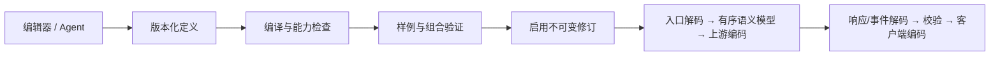

# 协议引擎、编辑器与原生 Agent

[English](protocol-guide.en.md) · [定义参考](protocol-definition-reference.md) · [验收与边界](protocol-release-readiness.md)

网关通过一套 `backend/protocol` 引擎运行内置协议和自定义协议。编辑器、Agent、预览、离线验证和真实转发共用编译器、语义模型与不可变修订；relay 负责传输和路由装配。旧 Maheshvara 转换器与模板执行器已删除，旧配置只可导入迁移。

## “无损”的范围

同协议未修改内容保留原生字段、未知扩展、数组顺序、数值、调用关联及原生载荷；允许 JSON 空白排版变化。跨协议保留双方可等价表达的能力。不能表达的工具、资源、推理签名或事件会产生诊断，不能静默删除或伪造成功。模型回答相同、未知机制自动兼容和跨供应商缓存资源互用均不在承诺范围内。



运行时固定协议版本、模型源和资源作用域。热更新只影响后续请求。配置变更使旧报告失效；真实输入与响应仍须遵守已验证契约。

## 支持矩阵

| 能力 | 当前支持与限制 |
| --- | --- |
| 内置协议 | Chat Completions、Responses、Anthropic、Gemini；请求、响应及流式方向 |
| 新协议双向接入 | 独立声明四个 HTTP 方向；入口为 `/gateway/:protocolId/*path`；原四入口保留 |
| HTTP JSON / SSE / NDJSON | 声明映射、分帧、结束与尾帧；流开始后不重放生成请求 |
| WebSocket | 双向 JSON 事件与声明的二进制媒体；有界队列、背压、超时与取消；不转码，不自动续接不支持恢复的会话 |
| 异步任务 | 提交、状态、结果、取消、重启恢复及幂等结算；提交结果不确定时不盲目重试 |
| 工具 | function、自由文本 custom、具备来源的服务端/原生工具；不托管客户端业务工具执行 |
| 缓存 | 块/工具/请求断点、TTL、key、retention、资源引用及读取/创建用量；必须有既有意图和正确声明 |
| 原生 Agent | 编写、验证、修订、迁移和排障；模型须支持 Agent 所需工具，遵守现有权限/计划/审批 |
| 不支持 | 任意运行时脚本/WASM、未实现的传输/语义、媒体自动转码、没有等价表示的跨协议原生扩展 |

能力声明是可验证承诺。文本专用协议可以接入；不能同时宣称支持未实现的工具。一个组合失败后，受限能力组合只能明确声明、独立验证；不能删请求字段来迁就目标。

## 通过编辑器录入

1. 在协议设计器新建草稿，填写 ID、版本、协议族、方向、传输和真实支持的能力。
2. 从当前引擎 schema 选择映射操作；分别编写请求解码/编码、响应解码/编码。流式、会话或任务补充对应事件及操作。
3. 为声明能力添加正向样例、预期结果和失败样例。工具须覆盖定义、调用、结果和多轮关联，流须有结束与 usage 尾帧。
4. 用转换预览查看输入、语义、输出和诊断。基础表单与高级 JSON 来回切换保留未知元数据、长整数、显式零值及原始顺序。
5. 保存草稿，执行离线验证。按字段路径修复诊断，通过后启用报告对应的确切修订。
6. 在模型源和模型组绑定已启用协议及能力/传输约束；检查组合报告。需要时单独运行真实上游测试。

保存不等于启用。修订比较和回滚也使用验证服务；不能回滚到当前引擎无法加载或未通过验证的版本。

完整可运行的从零样例见 [`text-alpha.json`](../backend/protocol/testdata/text-alpha.json)、[`text-beta.json`](../backend/protocol/testdata/text-beta.json)。实时与任务样例位于同目录的 `session-{alpha,beta}.json`、`job-{alpha,beta}.json`，均不引用内置 shape。实际供应商仍需补足其文档、字段和样例。

完整的缓存自定义协议示例见 [cached-text](examples/cached-text-v2.json)：请求策略位于 `promptPolicy`，响应用量位于 `meter`，不引用内置适配器，使用相同的离线验证器验收。

## Agent 工作流

`elysia` 是内置 `elysia_cli` 工具语法，不是独立 shell 程序。先读 `elysia help protocol` 和 `elysia protocol schema`，再执行“读供应商文档与样例 → 声明能力 → draft → validate/preview/verify → 按诊断修订 → save → activate”。Agent 不得通过删字段、删工具、缩减测试掩盖能力缺口。

`read`、`diff`、`diagnose`、`rollback` 使用相同服务。编辑模式保持协议 ID；已有草稿保存带 `--expected` 检查并发更新。REST/A2A 继续走会话审批；MCP 按既有权限执行，草稿工作流需在同一批命令中复用上下文。完整参数见 [CLI](agent-cli.md)。分发二进制中的 `elysia code` 可读取当前 Go、前端代码、协议预置和指南快照。

## 缓存配置与统计

已有 `cache_control.ttl` 被提取为独立语义字段：

```json
{"kind":"breakpoint","location":"block","value":{"type":"ephemeral"},"ttl":"1h"}
```

修改 `ttl` 会修改目标字段；省略表示删除，显式 null 保持 null。不要在 `value.ttl` 再保存一份。Chat 自定义副本携带块断点时须声明并用样例证明 `cache.breakpoints`，内置 Chat 默认不替请求开启此能力。缓存 key/retention 与 Gemini 资源引用不能当作同一种缓存对象。

新自定义字段路径用声明式读取/构造映射到 `cache`、节点 `cache` 或 `usage`。统计缺失与明确零值分开；自定义别名用 `exists` 判断存在性，不用真假值选择，确保 0 覆盖旧计数。完整 HTTP 验收见 `cache_custom_v2_test.go`，别名覆盖见 `usage_alias_test.go`。无缓存标记请求不会被补标记。

## 迁移、升级与恢复

升级前保留旧程序，以及配置、数据库和匹配主密钥的备份。先用管理 API 的 `/protocols/migration/preview` 检查整个图，按诊断修复，再用相同意图提交 `/migration/apply`。服务端重新计算验证，不接受客户端伪造报告。全部通过后备份数据库并在事务中切换，失败进入可修复的管理状态。

未编辑预置按完整历史内容指纹升级；用户修改内容不覆盖。引擎升级会重验已启用修订和绑定，保留用户草稿与停用状态。旧语义样例含 `value.ttl` 的自定义协议需将 TTL 移到相邻字段再验证。详见[迁移机制](protocol-migration-v2.md)及 [C16 契约](protocol-cutover-v2.md)。

协议修订回滚与程序/数据库回滚是不同操作。后者恢复旧程序、数据库、配置和主密钥的一致集合；一次 `git revert` 不会撤销数据库升级。

## 验证与发布

离线报告绑定定义哈希、编译器版本和样例集合。真实验证单独绑定上游、模型与配置。HTTP 200 不代表保真成功，测试通过也不代表线上缓存命中。缓存实测必须固定账号、模型和足够长的稳定前缀，在 TTL 内重复请求，并检查上游返回计数。

当前测试、性能代价、race 未验证状态、构建与主机冒烟见[发布清单](protocol-release-readiness.md)。所有工作只在本地；没有推送、发布或部署。
